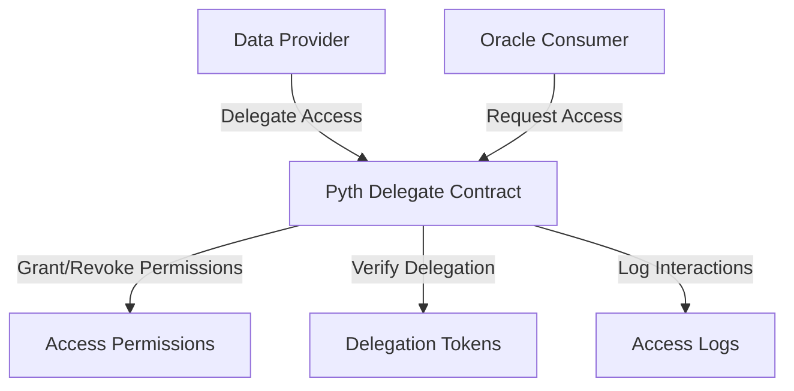

# Pyth Delegate

A smart contract for secure, decentralized data delegation and verification within the Pyth Network oracle ecosystem.

## Overview

Pyth Delegate enables precise, controlled access to oracle data through a sophisticated delegation mechanism. The contract provides:

- Granular permission management for data access
- Secure delegation of verification rights
- Immutable access logging
- Fine-grained access control for oracle data
- Cryptographically secure delegation tokens

## Architecture

The Pyth Delegate contract manages data access delegation and verification within the Pyth Network.



### Key Components
- **Data Providers**: Create and manage data delegation
- **Oracle Consumers**: Request and verify data access
- **Delegation Tokens**: Cryptographic proofs of access rights
- **Access Permissions**: Dynamic, time-bound access controls
- **Verification Logs**: Immutable record of all access events

## Contract Documentation

### Pyth Delegate Contract

The main contract manages oracle data delegation and access control:

#### Data Structures
- `users`: User delegation profiles
- `providers`: Registered data providers
- `delegations`: Active delegation tokens
- `access-permissions`: Granular access controls
- `access-logs`: Audit trail of data interactions

#### Key Functions

##### Delegation Management
```clarity
(define-public (create-delegation (consumer principal) (permissions (list 20 (string-utf8 50))))
(define-public (revoke-delegation (delegation-id uint))
```

##### Verification Mechanisms
```clarity
(define-public (verify-delegation (delegation-id uint) (consumer principal))
(define-read-only (check-delegation-validity (delegation-id uint)))
```

## Getting Started

### Prerequisites
- Clarinet
- Stacks wallet
- Understanding of oracle systems

### Installation

1. Clone the repository
2. Install dependencies
```bash
clarinet integrate
```

### Usage Examples

1. Create a delegation:
```clarity
(contract-call? .pyth-delegate create-delegation 'CONSUMER_ADDRESS (list "price-data" "volatility"))
```

2. Verify a delegation:
```clarity
(contract-call? .pyth-delegate verify-delegation u1 'CONSUMER_ADDRESS)
```

## Security Considerations

1. Delegation Security
    - Cryptographically signed delegation tokens
    - Time-bound access permissions
    - Granular access control

2. Verification Mechanisms
    - Strict validation of delegation rights
    - Immediate revocation capabilities
    - Comprehensive access logging

3. Provider Authentication
    - Rigorous provider registration process
    - Regular credential verification

## Development

### Testing
```bash
clarinet test
```

### Local Development
```bash
clarinet console
clarinet deploy
```

### Key Considerations
- Implement robust signature verification
- Minimize gas consumption
- Conduct regular security audits
- Maintain comprehensive logging
- Design for extensibility